# NetLogo-Shapes <a href = "https://github.com/danielvartan/netlogo-actions">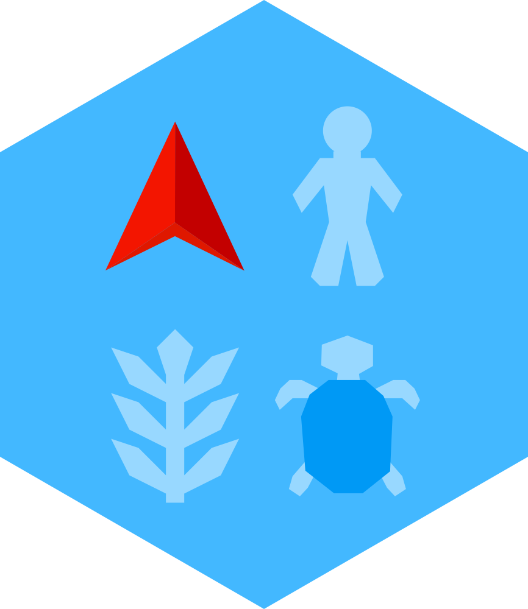</a>

<!-- badges: start -->

<!-- badges: end -->

## Overview

`NetLogo-Shapes` provides a library of [NetLogo](https://www.netlogo.org/) vector graphics. Whether you are building custom simulations or creating educational content, these assets allow you to modify and scale NetLogo’s iconic shapes without losing quality.

> If you find this project useful, please consider giving it a star! &nbsp; 

## Usage

All shapes are located in the repository `shapes` directory. These vectors are optimized for [Inkscape](https://inkscape.org) SVG standards, stripping unnecessary metadata to maintain the smallest possible file size.

The collection features all 230 default shapes from NetLogo 7.0.3:

<table>
  <tr bgcolor="#1e1e1e">
    <td>
      &nbsp;
      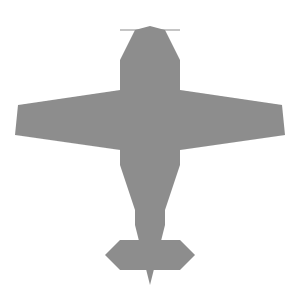&nbsp;
      &nbsp;
      &nbsp;
      &nbsp;
      &nbsp;
      &nbsp;
      &nbsp;
      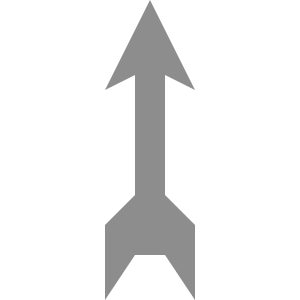&nbsp;
      &nbsp;
      &nbsp;
      &nbsp;
      &nbsp;
      &nbsp;
      &nbsp;
      &nbsp;
      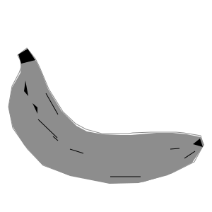&nbsp;
      &nbsp;
      &nbsp;
      &nbsp;
      &nbsp;
      &nbsp;
      &nbsp;
      &nbsp;
      &nbsp;
      &nbsp;
      &nbsp;
      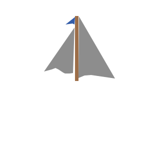&nbsp;
      &nbsp;
      &nbsp;
      &nbsp;
      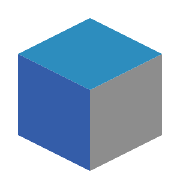&nbsp;
      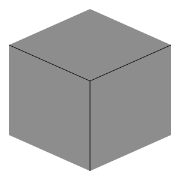&nbsp;
      &nbsp;
      &nbsp;
      &nbsp;
      &nbsp;
      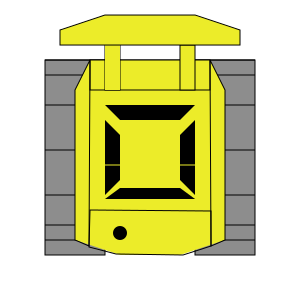&nbsp;
      &nbsp;
      &nbsp;
      &nbsp;
      &nbsp;
      &nbsp;
      &nbsp;
      &nbsp;
      &nbsp;
      &nbsp;
      &nbsp;
      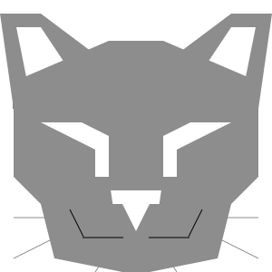&nbsp;
      &nbsp;
      &nbsp;
      &nbsp;
      &nbsp;
      &nbsp;
      &nbsp;
      &nbsp;
      &nbsp;
      &nbsp;
      &nbsp;
      &nbsp;
      &nbsp;
      &nbsp;
      &nbsp;
      &nbsp;
      &nbsp;
      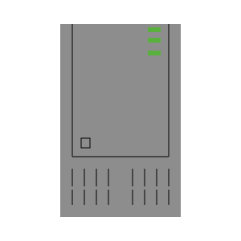&nbsp;
      &nbsp;
      &nbsp;
      &nbsp;
      &nbsp;
      &nbsp;
      &nbsp;
      &nbsp;
      &nbsp;
      &nbsp;
      &nbsp;
      &nbsp;
      &nbsp;
      &nbsp;
      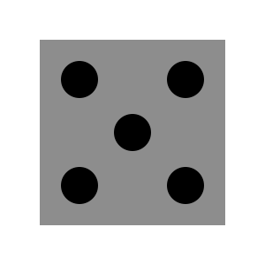&nbsp;
      &nbsp;
      &nbsp;
      &nbsp;
      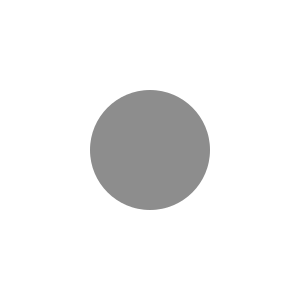&nbsp;
      &nbsp;
      &nbsp;
      &nbsp;
      &nbsp;
      &nbsp;
      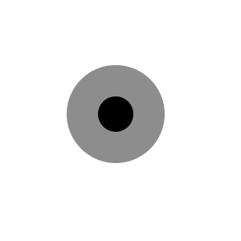&nbsp;
      &nbsp;
      &nbsp;
      &nbsp;
      &nbsp;
      &nbsp;
      &nbsp;
      &nbsp;
      &nbsp;
      &nbsp;
      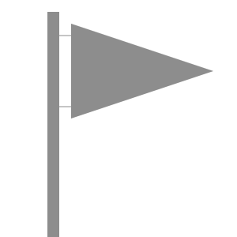&nbsp;
      &nbsp;
      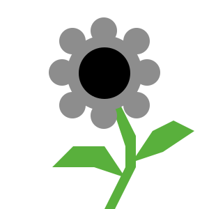&nbsp;
      &nbsp;
      &nbsp;
      &nbsp;
      &nbsp;
      &nbsp;
      &nbsp;
      &nbsp;
      &nbsp;
      &nbsp;
      &nbsp;
      &nbsp;
      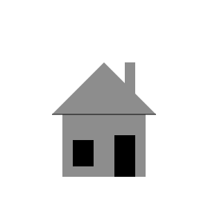&nbsp;
      &nbsp; 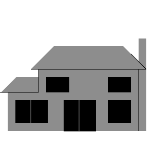&nbsp;
      &nbsp;
      &nbsp;
      &nbsp;
      &nbsp;
      &nbsp;
      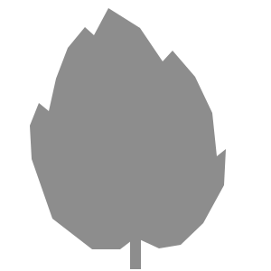&nbsp;
      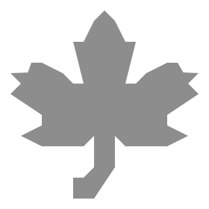&nbsp;
      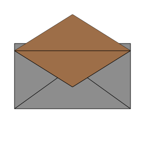&nbsp;
      &nbsp;
      &nbsp;
      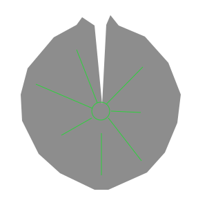&nbsp;
      &nbsp;
      &nbsp;
      &nbsp;
      &nbsp;
      &nbsp;
      &nbsp;
      &nbsp;
      &nbsp;
      &nbsp;
      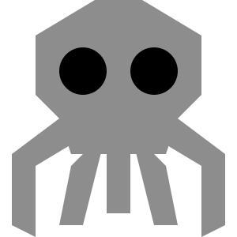&nbsp;
      &nbsp;
      &nbsp;
      &nbsp;
      &nbsp;
      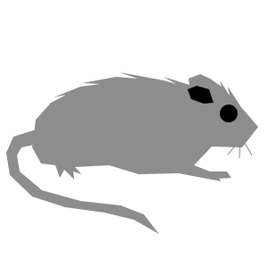&nbsp;
      &nbsp;
      &nbsp;
      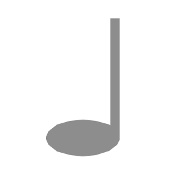&nbsp;
      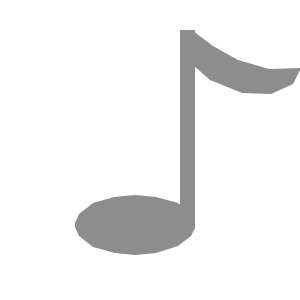&nbsp;
      &nbsp;
      &nbsp;
      &nbsp;
      &nbsp;
      &nbsp;
      &nbsp;
      &nbsp;
      &nbsp;
      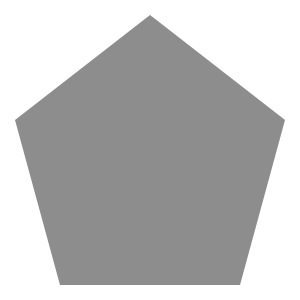&nbsp;
      &nbsp;
      &nbsp;
      &nbsp;
      &nbsp;
      &nbsp;
      &nbsp;
      &nbsp;
      &nbsp;
      &nbsp;
      &nbsp;
      &nbsp;
      &nbsp;
      &nbsp;
      &nbsp;
      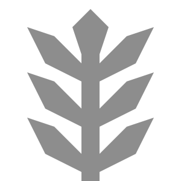&nbsp;
      &nbsp;
      &nbsp;
      &nbsp;
      &nbsp;
      &nbsp;
      &nbsp;
      &nbsp;
      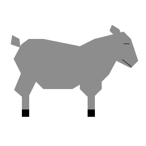&nbsp;
      &nbsp;
      &nbsp;
      &nbsp;
      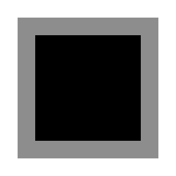&nbsp;
      &nbsp;
      &nbsp;
      &nbsp;
      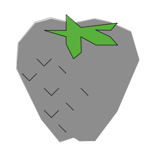&nbsp;
      &nbsp;
      &nbsp;
      &nbsp;
      &nbsp;
      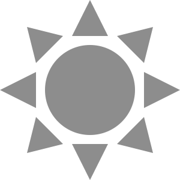&nbsp;
      &nbsp;
      &nbsp;
      &nbsp;
      &nbsp;
      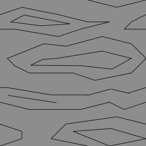&nbsp;
      &nbsp;
      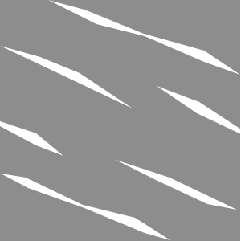&nbsp;
      &nbsp;
      &nbsp;
      &nbsp;
      &nbsp;
      &nbsp;
      &nbsp;
      &nbsp;
      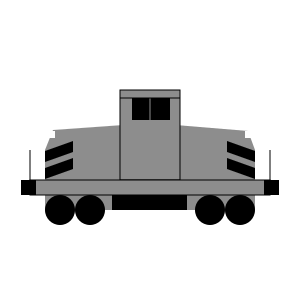&nbsp;
      &nbsp;
      &nbsp;
      &nbsp;
      &nbsp;
      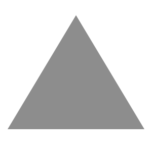&nbsp;
      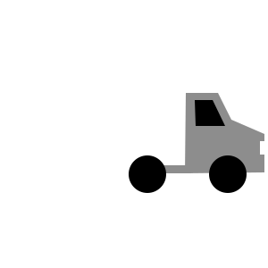&nbsp;
      &nbsp;
      &nbsp;
      &nbsp;
      &nbsp;
      &nbsp;
      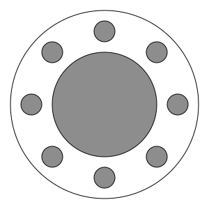&nbsp;
      &nbsp;
      &nbsp;
      &nbsp;
      &nbsp;
      &nbsp;
      &nbsp;
      &nbsp;
      &nbsp;
      &nbsp;
      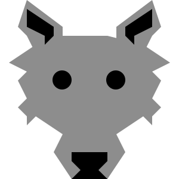&nbsp;
      &nbsp;
      &nbsp;
    </td>
  </tr>
</table>

## Technical Specifications

### Canvas & Coordinate System

Each shape is centered on a **300×300 pixel** canvas. Following NetLogo XML and SVG standards, the origin `(0, 0)` is located at the top-left corner.

### Color Mapping

The library uses the standard [NetLogo base colors](https://docs.netlogo.org/dictionary.html#base-colors). The table below maps these to Hexadecimal and NetLogo’s internal XML integer format for cross-compatibility.

| Color     | Name      | NetLogo | Hex     | XML          |
|-----------|-----------|---------|---------|--------------|
|  | black     | 0       | #000000 | 255          |
|  | white     | 10      | #FFFFFF | -1           |
|  | gray      | 5       | #8D8D8D | -1920102913  |
|  | red       | 15      | #D73229 | -684578305   |
|  | orange    | 25      | #F16A15 | -244705793   |
|  | brown     | 35      | #9D6E48 | -1653716737  |
|  | yellow    | 45      | #ECEC29 | -303222273   |
|  | green     | 55      | #59B03C | 1504722175   |
|  | lime      | 65      | #2CD13B | 751909887    |
|  | turquoise | 75      | #1D9F78 | 496990463    |
|  | cyan      | 85      | #54C4C4 | 1422181631   |
|  | sky       | 95      | #2D8DBE | 764264191    |
|  | blue      | 105     | #345DA9 | 878553599    |
|  | violet    | 115     | #7C50A4 | 2085659903   |
|  | magenta   | 125     | #A71B6A | -1491375361  |
|  | pink      | 135     | #D9637F | -528509185   |

## License

All repository content is dedicated to the public domain under [CC0 1.0 Universal](https://creativecommons.org/publicdomain/zero/1.0/). You are free to copy, modify, and distribute this work for any purpose, including commercial use, without needing permission or providing attribution.

## Contributing

Contributions are always welcome! Whether you want to report bugs, suggest new features, or help improve the code or documentation, your input makes a difference.

Before opening a new issue, please check the [issues tab](https://github.com/danielvartan/netlogo-shapes/issues) to see if your topic has already been reported.
